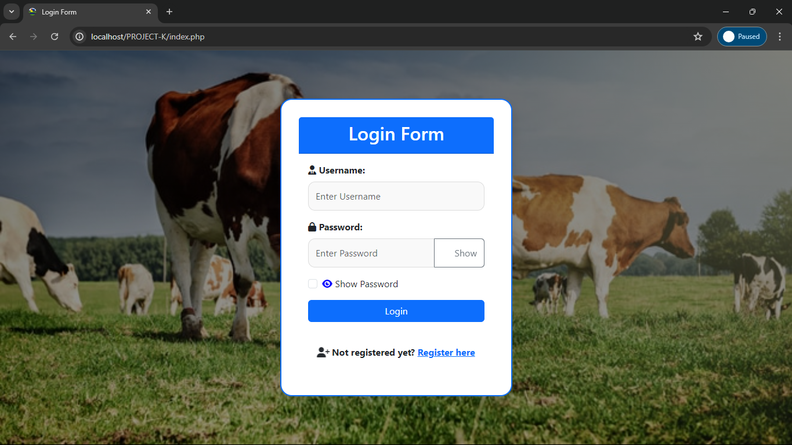
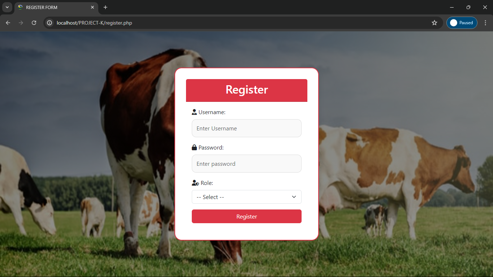
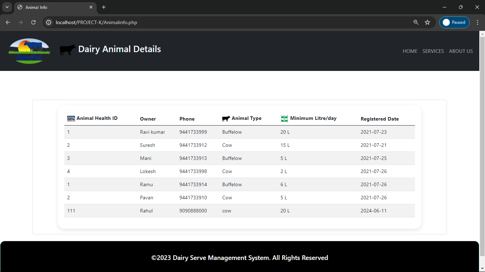
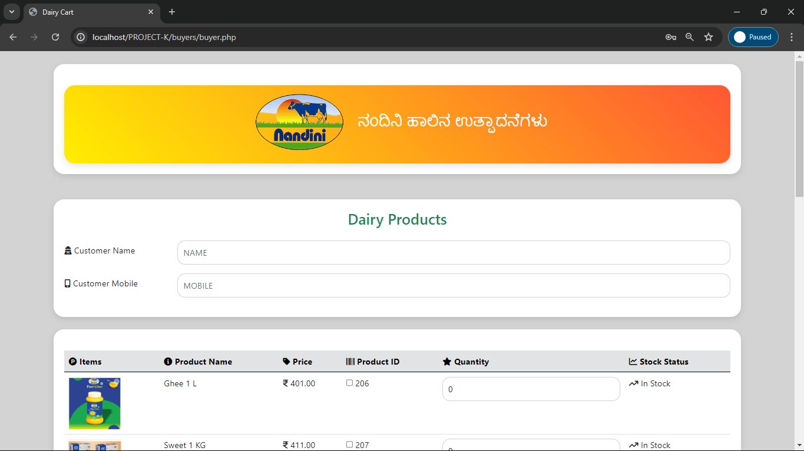
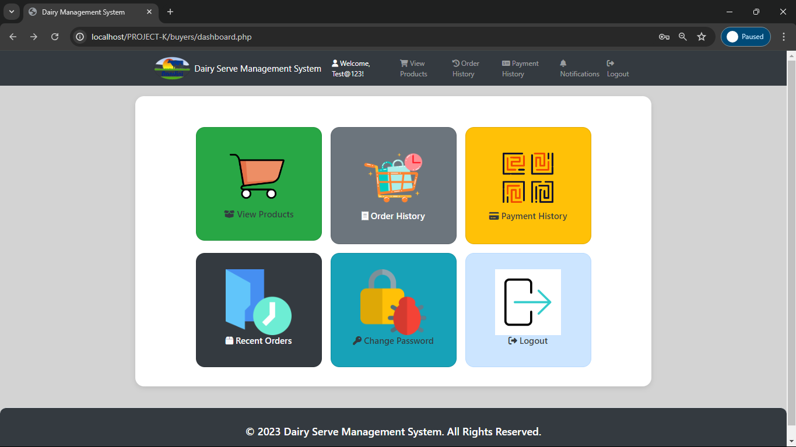

# Dairy Serve Management System

## Description

The Dairy Serve Management System is a comprehensive solution designed to manage various aspects of a dairy business. The system is built using HTML, CSS, Bootstrap, JavaScript for the front end, and PHP, MySQL (WAMP) for the backend. It includes multiple modules and functionalities tailored to streamline operations, manage data efficiently, and provide an intuitive interface for different user roles.
## Dashboard
 
 
  <hr>
  ## Features

- **Admin Dashboard**: Manage farmers, staff, products, and view reports.
- **Farmer Dashboard**: View farmer details, dairy animal details, daily data entries, and bills.
- **Staff Dashboard**: View and add daily data entries, generate bills.
- **Buyer Dashboard**: View products, place orders, view order history, make payments, and receive invoices.
- **Razorpay Payment Gateway**: Secure online payment processing.
<hr>
## Modules

1.  Login/Register Module 
   - This module provides a secure login system for users. It includes features for user authentication and access control based on user roles (Admin, Staff, Farmer, Buyer).
     
     
<hr>
2.  Farmer Details Module 

   - This module manages the details of farmers associated with the dairy. It allows adding, updating, and viewing farmer profiles, including personal information, farm details, and contact information.
        
     
<hr>
3.  Staff Details Module 
   
   - This module handles the details of staff members. It allows for the management of staff profiles, including adding new staff, updating existing profiles, and viewing staff information.
     
     

<hr>
4.  Dairy Animal Details Module 
   
   - This module maintains records of dairy animals. It includes features for adding new animals, tracking health and productivity data, and managing overall animal details.
     
<hr>
5.  Daily Data Entry Module 
   
   - This module facilitates daily data entry related to dairy operations. It includes forms for recording milk production, feed usage, health checks, and other routine activities.
    
<hr>
6.  Bill Module 
   
   - This module generates and manages bills for various transactions. It includes features for creating invoices, tracking payments, and maintaining billing records for customers and suppliers.
     
<hr>
7.  Dairy Products Module 
   
   - This module manages the inventory of dairy products. It allows adding new products, updating product details, managing stock levels, and tracking product sales.



<hr>
8.  Admin Order Management Module 
   
   - This module provides tools for admins to manage orders. It includes features for viewing, updating, and processing customer orders, handling order status, and generating order reports.
     
<hr>
**Integrate Razorpay Checkout**:
   - Add the Razorpay Checkout script in your payment page:
     ```html
     <script src="https://checkout.razorpay.com/v1/checkout.js"></script>
     ```
   - Create a Razorpay order and handle the payment in your PHP backend:
     ```php
     // In your payment processing file (e.g., process_payment.php)
     require('razorpay_config.php');
     $api = new Api($keyId, $keySecret);

     $orderData = [
         'receipt'         => 3456,
         'amount'          => 100 * 100, // 100 rupees in paise
         'currency'        => 'INR',
         'payment_capture' => 1 // auto capture
     ];

     $razorpayOrder = $api->order->create($orderData);

     $razorpayOrderId = $razorpayOrder['id'];
     $_SESSION['razorpay_order_id'] = $razorpayOrderId;

     $displayAmount = $amount = $orderData['amount'];

     if ($displayCurrency !== 'INR')
     {
         $url = "https://api.fixer.io/latest?symbols=$displayCurrency&base=INR";
         $exchange = json_decode(file_get_contents($url), true);

         $displayAmount = $exchange['rates'][$displayCurrency] * $amount / 100;
     }

     $checkout = [
         "key"               => $keyId,
         "amount"            => $amount,
         "name"              => "Dairy Serve Management System",
         "description"       => "Order #12345",
         "image"             => "https://example.com/your_logo",
         "prefill"           => [
             "name"              => "Your Name",
             "email"             => "email@example.com",
             "contact"           => "9999999999",
         ],
         "notes"             => [
             "address"           => "Your Address",
             "merchant_order_id" => "12312321",
         ],
         "theme"             => [
             "color"             => "#F37254"
         ],
         "order_id"          => $razorpayOrderId,
     ];

     $json = json_encode($checkout);
     ```
   - Handle the payment success or failure in your `callback` endpoint.
<hr>
## User Privileges

### Admin

- Full access to all modules and functionalities.
- Ability to manage users, products, and orders.
<hr>
 
### Staff


### Staff
- View and edit personal details.
- Access dashboard.
- Manage products cart.
- View order history.
- View payment history.
<hr>
 
### Farmer

 ### Farmer
- View and edit personal details.
- Access dashboard.
- Manage products cart.
- View order history.
- View payment history.
<hr>
 
### Buyer

 ### Buyer
 
- Manage products cart.
- View order history.
- View payment history.
<hr>
 
 ### Technologies Used
<hr>
 
### Frontend
- HTML
- CSS
- Bootstrap
- JavaScript
<hr>
 
  
### Backend
- PHP
- MySQL (WAMP)
<hr>
 
  
## Installation Steps

### WAMP Installation
1. Download WAMP server from the [official website](https://github.com/Ravi191203/DAIRY-SERVE-MANAGEMENT-SYSTEM/tree/main/wamp).
2. Run the installer and follow the on-screen instructions to install WAMP on your system.
3. After installation, start the WAMP server.
<hr>
 
  
### Project Setup
1. Clone the project repository or download the project files.
2. Copy the project files to the `www` directory in your WAMP installation (usually located at `C:\wamp\www`).
3. Open PHPMyAdmin by navigating to `http://localhost/phpmyadmin`.
4. Create a new database for the project.
5. Import the database schema from the provided SQL file into the newly created database.
6. Update the database configuration in the project files (usually in a `config.php` or `db_connect.php` file) with your database name, username, and password.
7. Start the WAMP server and navigate to `http://localhost/your_project_directory` to access the application.
<hr>

## Usage

1. **Login**:
   - Access the login page and enter your credentials.
   - Based on your role, you will be redirected to the respective dashboard.

2. **Admin Dashboard**:
   - Manage farmers, staff, and products.
   - View reports and generate bills.

3. **Farmer Dashboard**:
   - View farmer and dairy animal details.
   - View and add daily data entries.
   - View bills.

4. **Staff Dashboard**:
   - View staff details.
   - Generate bills and manage daily data entries.

5. **Buyer Dashboard**:
   - View products, place orders, view order history.
   - Make payments using Razorpay and receive invoices.

<hr>
 ## Contributing

1. Fork the repository.
2. Create your feature branch: `git checkout -b feature-name`.
3. Commit your changes: `git commit -m 'Add some feature'`.
4. Push to the branch: `git push origin feature-name`.
5. Submit a pull request.
<hr>
## How to Run
1. Ensure WAMP server is running.
2. Open a web browser and navigate to `http://localhost/your_project_directory`.
3. You should see the login page of the Dairy Serve Management System.
4. Log in using the credentials provided during setup or create a new account.
5. Access the various modules and functionalities based on your user privileges.

Enjoy managing your dairy operations efficiently with the Dairy Serve Management System!
<hr>
 
## License

This project is licensed under the MIT License - see the [LICENSE](LICENSE) file for details.
<hr>

<center>************* THANK YOU *************</center>
